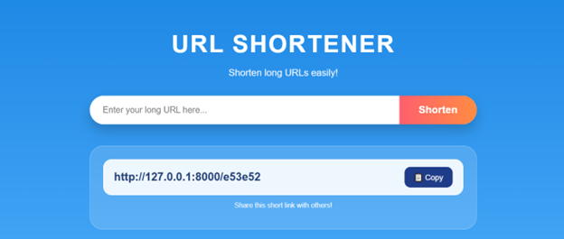

🔗 Django URL Shortener

A simple and modern URL shortening web application built using Django.

🌐 Website Preview


## Overview

A Django-based web application that allows users to convert long URLs into short, shareable links. The application provides a simple and intuitive interface for URL shortening with copy-to-clipboard functionality.

## Features

- **Easy URL Shortening**: Paste your long URL and get a shortened version instantly
- **Copy to Clipboard**: One-click copying of generated short URLs
- **Unique Short Codes**: Each URL is assigned a unique identifier for easy sharing
- **Local Access**: Access via localhost (http://127.0.0.1:8000/)

## Project Structure

```
Url_shortner/
├── core/                 # Django project settings
│   ├── settings.py      # Project configuration
│   ├── urls.py          # Main URL routing
│   ├── wsgi.py          # WSGI configuration
│   └── asgi.py          # ASGI configuration
├── shortener/           # Main Django app
│   ├── models.py        # Database models
│   ├── views.py         # View logic
│   ├── urls.py          # App URL routing
│   ├── templates/       # HTML templates
│   └── migrations/      # Database migrations
├── manage.py            # Django management script
├── db.sqlite3           # SQLite database
└── requirements.txt     # Python dependencies
```

## Installation

1. **Clone or navigate to the project directory**
   ```bash
   cd Url_shortner
   ```

2. **Install dependencies**
   ```bash
   pip install -r requirements.txt
   ```

3. **Run migrations**
   ```bash
   python manage.py migrate
   ```

4. **Start the development server**
   ```bash
   python manage.py runserver
   ```

5. **Access the application**
   Open your browser and navigate to: `http://127.0.0.1:8000/`

## Usage

1. Enter your long URL in the input field
2. Click the "Shorten" button
3. Your shortened URL will be generated (e.g., `http://127.0.0.1:8000/e53e52`)
4. Click the "Copy" button to copy the short link to your clipboard
5. Share the shortened URL with others!

## Technologies Used

- **Backend**: Django
- **Database**: SQLite3
- **Frontend**: HTML/CSS
- **Python Version**: 3.x

## Requirements

See `requirements.txt` for all project dependencies.


👩‍💻 Author

KRISTINA HYAUNMIKHA

⭐ If you like this project

Give a star ⭐ to the repository!
